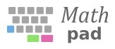

<h3>
A mathematical keypad for students and professionals
</h3>

  

    <h1><a href="#/getting_started.md" style="text-decoration: none;">📝</a></h1>
    <h3><a href="#/getting_started.md" style="text-decoration: none;">Learn the ropes</a></h3>
    
Start using Mathpad right now by following the 
    <a href="#/getting_started.md" style="text-decoration: none;">Getting Started guide</a>. Perfect if you've never 
    used Mathpad before.

  

  
  

    <h1><a href="/getting-started" style="text-decoration: none;">📖</a></h1>
    <h3><a href="/getting-started" style="text-decoration: none;">Become a pro</a></h3>
    
Get familiar with the wide range of symbols that the Mathpad provides. Customize its behavior to fit your 
        needs. 

  

  
  

    <h1><a href="/getting-started" style="text-decoration: none;">🔧</a></h1>
    <h3><a href="/getting-started" style="text-decoration: none;">Step it up a notch</a></h3>
    
Dive into the technical documentation and learn how to modify your Mathpad and how to assemble one from 
    scratch.

  

