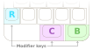

# Getting started

> >[!TIP|label:Before You Continue]
>Make sure you have already followed the instructions in [First Setup](/first_setup.md).
>

## Understanding the Mathpad symbol keys
All symbol keys are divided into two parts: A white LEFT and a blue RIGHT. Symbols are placed in three coloured rows: 
TOP, CENTER, and BOTTOM.

Symbols on the same row are almost always related. On the particular symbol key shown here:
1) The TOP row has Greek letters
2) The CENTER row has relationship operators
3) The BOTTOM row has accents.

**The default symbol is always in the top left corner**. The particular symbol key shown above will therefore give you 
$α$ (Greek letter Alpha) when you press it, and we name the key <keycombo>[α]</keycombo>. The next section explains how 
you access the other symbols on the key.

## Using the modifier keys
Accessing the five other symbols is done by combining a symbol key with one or two of the coloured modifier keys.

The [R] modifier key selects the blue RIGHT side of the symbol key. The [B] modifier key selects the BOTTOM row 
of symbols, and the [C] modifier key selects the CENTER row. 

## Give it a shot!
>[!TIP|label:Before You Continue]
>Set your Mathpad to Plaintext mode by holding down the black MODE key (top right) for one second.
>
Let's get you comfortable with the Mathpad symbol system by practicing some key combinations. 

We'll start simple. Click on the text editor below, and tap the <keycombo>[α]</keycombo> key once. This is the top left 
key on your Mathpad. Clicking this key will output the Greek letter Alpha.

  

    <textarea rows="1" cols="20" style="font-family:'Cambria Math';font-size: 30pt"></textarea>
  

>[!NOTE|label:In Case Of Problems]
>If instead of $\alpha$ you get a bunch of random symbols or nothing at all, make sure you have followed 
> [First Setup](/first_setup.md). If you get '\alpha', you must set your Mathpad to Plaintext mode. If you still have 
> problems, refer to [Troubleshooting](/troubleshoot.md)
>

Let's move on to something a bit more advanced. Locate the <keycombo>[η]</keycombo> key on your Mathpad, and click the 
text editor below. Then, type $\geq$ by keeping the [C] modifier key pressed while clicking 
<keycombo>[η]</keycombo>.

  

    <textarea rows="1" cols="20" style="font-family:'Cambria Math';font-size: 30pt"></textarea>
  

Finally, type $\mathbb{C}$ by keeping the [R] and [B] modifier keys pressed while clicking <keycombo>[ω]</keycombo>.

  

    <textarea rows="1" cols="20" style="font-family:'Cambria Math';font-size: 30pt"></textarea>
  

Look at you tapping away! Here's a few more key combinations you can try. See [Symbols](/symbols.md) for all symbols 
and how to type them.
- $\delta$ : <keycombo>[B]+[γ]</keycombo>
- $\int$ : <keycombo>[C]+[λ]</keycombo>
- $\gg$ : <keycombo>[R][C]+[η]</keycombo>
- $\bigoplus$ : <keycombo>[R][B]+[ν]</keycombo>
