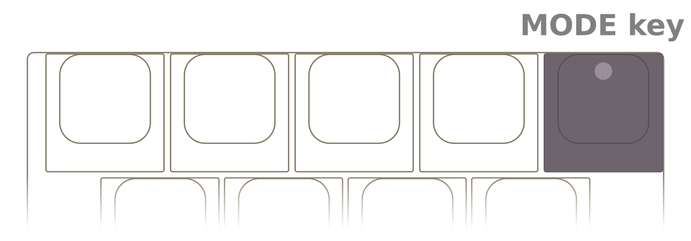

The default output mode of Mathpad is Plaintext. In Plaintext mode, Mathpad outputs simple Unicode symbols. This mode 
is the most versatile, and works with virtually all text editors. 

If you are instead working in the typesetting language LaTeX, or using the equation editors of Microsoft Office or 
Apache OpenOffice, you'll want to switch modes by clicking the MODE key:

## LaTeX mode
**Set LaTeX mode by clicking the MODE key until it lights magenta.**

In LaTeX mode, Mathpad will type LaTeX codes. Test it here:

  

    <textarea id="latex-input" rows="1" cols="50" placeholder="Click here and type"></textarea>
  

  

    

  

> [!TIP]
> You can always get Mathpad back to Plaintext mode by holding down the MODE key for one second.
>

## Microsoft Office Equation Editor mode
**Set Microsoft Office mode by clicking the MODE key until it lights orange.** 

In this mode, Mathpad will type codes 
that works specifically with the equation editor that is built into many Microsoft Office applications, such as Word.

## LibreOffice Equation Editor mode
**Set LibreOffice mode by clicking the MODE key until it lights cyan.**