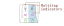

# Multitap

Many symbols are marked by a small orange dot. Tapping such a symbol twice quickly will type a different 
but related symbol. For example, double-tapping <keycombo>[δ]</keycombo> types its uppercase variant Δ. The notation 
for this action is <keycombo>[δ][x2]</keycombo>.

Certain symbols can be triple-tapped. For example, to type ∜ you must triple-tap <keycombo>[√]</keycombo>. 
Double-tapping it types ∛.

To multitap a symbol that requires the use of modifier keys, you must keep the modifier keys pressed and only multitap 
the symbol key. For example, to get ≅, you must keep [R] and [C] pressed while you tap <keycombo>[≃]</keycombo> twice 
quickly.

Try multitapping some symbols in the text editor below to get used to it. 

  

    <textarea rows="1" cols="20" style="font-family:'Cambria Math';font-size: 30pt"></textarea>
  

