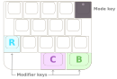

On the back there is the OS switch, an LED indicating if the 
Mathpad is powered, and the USB-C port.

The top of Mathpad is full of keys. There are 3 rows of symbol keys, three colored Modifier keys, and the  
Mode key.

