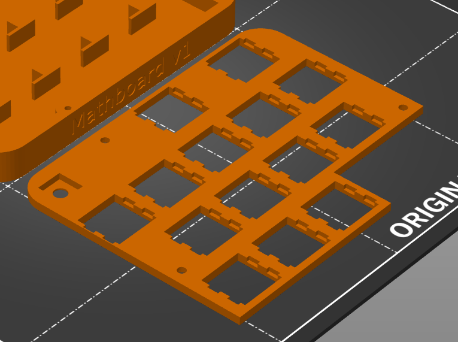

3D printing the Mathboard parts
###############################
.. note::
    Prerequisites:
     * A 3D printer with at least 8cm x 10cm build surface
     * PLA filament of any color for the case
     * White PLA filament for the LED diffuser

Printing the case and diffuser
==============================
Open your slicer software and import the following two Mathboard case files:

* /hardware/case/Bottom.stl
* /hardware/case/Lid.stl

They can be printed at the same time using the same settings. They are simple parts, and should be printable with the
default settings of your slicer. **Ensure that the lid is printed upside down**, as shown here:

Once the bottom and the lid have been printed, move on to the diffuser. Import the following file in your slicer
software:

* /hardware/case/Diffuser.stl

This part must be printed with white filament to allow the status LED to shine through. Again, this part should be
printable with defaul slicer settings.

.. _Risers:

Printing the keycap risers
===========================
The keycap risers exist to make the OEM R2 keycaps compatible with the low profile Gateron switches. They raise the
keycaps up by 1mm so that they do not crash into the top of the Mathboard before the switch has been fully pressed.

You will need 16 of these keycap risers, one for each switch on the mathboard. Import the following file in your
slicer software:

* /hardware/case/Keycap risers.stl

The keycap risers are very small components with tight tolerances, and may require some tuning to print correctly. I
have personally had success with the following settings:

* Layer height : 0.2mm
* Skirt : Yes
* Speed : 20% of normal
