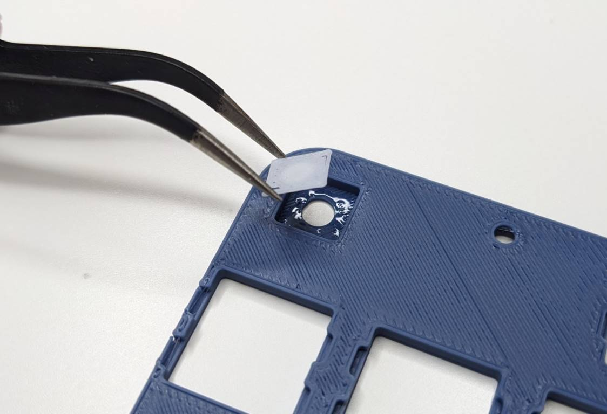
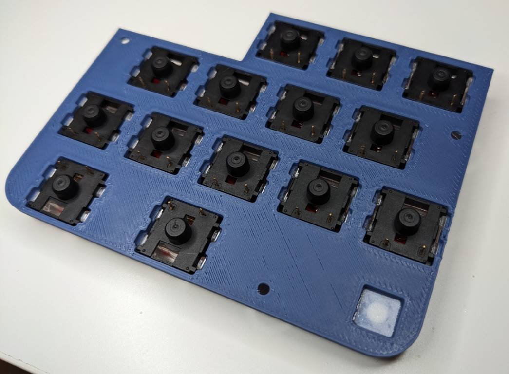

.. _Assembling the lid:

Assembling the lid
##################
.. note::
    Prerequisites:
     * 1x Mathboard lid
     * 1x Diffuser
     * 14x `Gateron KS-33 Low Profile v2 switches <https://www.gateron.co/products/gateron-low-profile-mechanical-switch-set>`_
     * Cyanoacrylate glue

Begin by gluing the diffuser into the lid. Add a small amount of glue to the flat part of the recession in the lid
where the diffuser will sit. Insert the diffuser and apply pressure to ensure that it is flush with the lid surface.
The glue should dry within 5 minutes.

Once the glue is dry and the diffuser won't fall out, insert the Gateron switches into the lid. Ensure that they are
inserted in the correct orientation. Note that the two bottom switches must be oriented with 180 degrees rotation.

