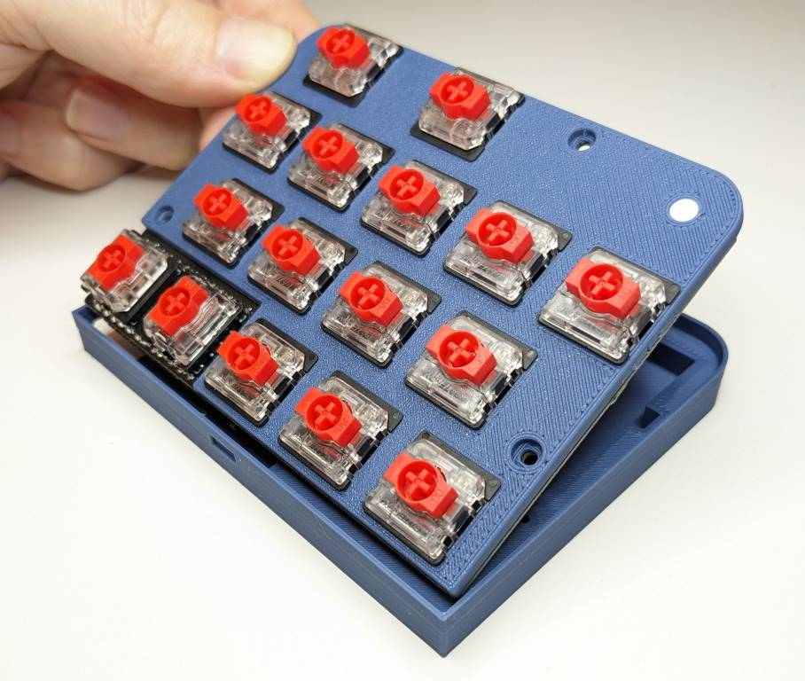
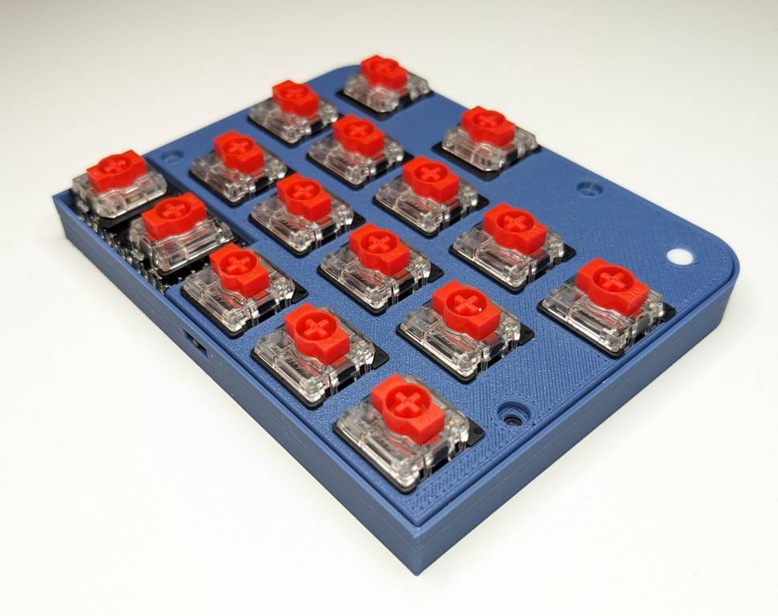
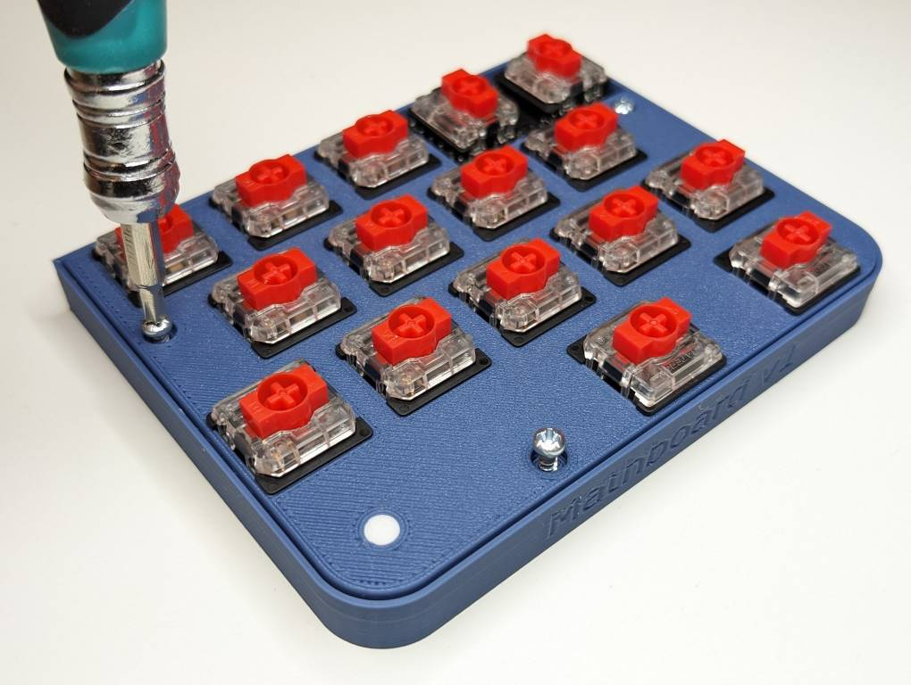
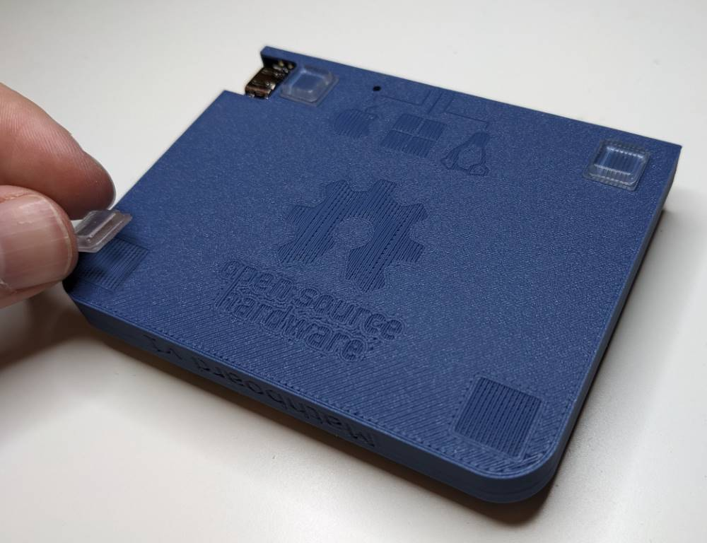
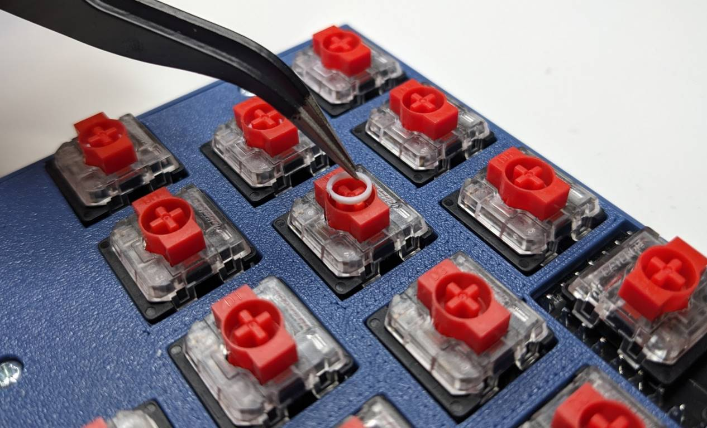

Integration and keycaps
====================
.. note::
    Prerequisites:
     * 1x Mathboard bottom
     * 1x :ref:`Fully assembled lid with PCB <Soldering the PCB>`.
     * 3x self-tapping M2.2 x 6mm screws
     * 4x rubber feet
     * 16x keycaps
     * 16x :ref:`keycap risers <Risers>` if using OEM R2 keycaps

Insert the :ref:`Fully assembled lid with PCB <Soldering the PCB>` onto the bottom at an angle, so that the small OS
switch on the back of the PCB can enter its cutout
in the bottom. Then, lower the lid down until it sits flush with the bottom. Screw the lid onto the bottom using the
self-tapping M2.2 x 6mm screws. Flip the Mathboard over and attach the rubber feet.

Keycaps
#######
If you are using OEM R2 keycaps, first place one :ref:`keycap riser <Risers>` into each switch. The risers have tight
tolerances, and they might not fit if your printer did not print them correctly. Place the keycaps on the switches and
press down well to insert them fully into the switches.

