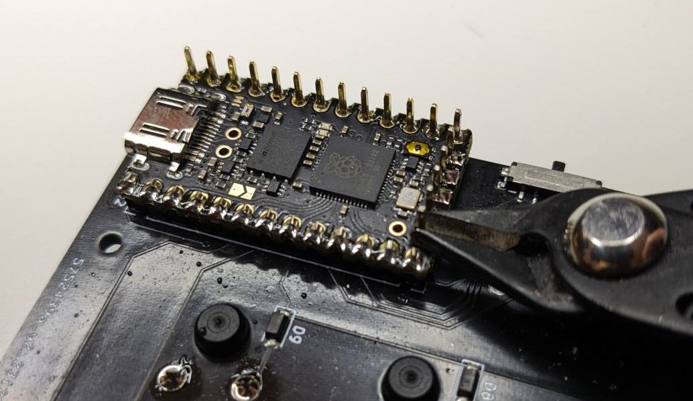

.. _Soldering the PCB:

Soldering the PCB
#################
.. note::
    Prerequisites:
     * 1x Mathboard PCB
     * 1x `0xCB Helios RP2040 microcontroller <https://github.com/0xCB-dev/0xCB-Helios>`_
     * 2x `Gateron KS-33 Low Profile v2 switches <https://www.gateron.co/products/gateron-low-profile-mechanical-switch-set>`_
     * 1x :ref:`Assembled lid <Assembling the lid>`.
     * A wire clipper

The Mathboard has been designed to be easy to make. Thus, the PCB only uses through-hole
components for the parts that must be soldered by hand. Through-hole components are easy to solder even with
low-quality soldering irons and no previous experience.

Switches
======
Place the :ref:`Assembled lid <Assembling the lid>` on a flat surface with the switches pointing down. Place the PCB
on top of the lid, with the switch pins going through the PCB. Solder all the switch pins to the PCB.

.. tip::
    The Mathboard PCB is thin, and has a tendency to flex. It is a good idea to apply bit of pressure to the PCB
    when soldering the switch pins so that the PCB is flush with the lid.

TODO: Insert image of soldering the switches

Insert two Gateron KS-33 Low Profile v2 switches in the two slots surrounded by the microcontroller pin headers. Solder
them to the PCB.

Microcontroller
======

.. important::
    Do not solder the microcontroller before you solder the two top right switches, as their solder pads are
    covered by the microcontroller.

Place the 0xCB Helios RP2040 microcontroller on the pin headers. Be careful to not place it upside down. The
side with all the components on it must be visible. See the photo below for reference.

Solder the microcontroller to the pin headers. Once finished, use the wire clipper to cut the pin headers short.

