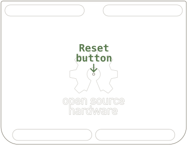

Firmware is the code that runs on the processor inside the Mathpad. You must sometimes update this firmware, 
for example when:
- You set up your Mathpad for the first time
- You change the keyboard layout on your computer
- You want to use a feature in a new firmware release
- You make your own modifications to the firmware

**Updating the Mathpad firmware is safe and extremely simple**. It requires no previous experience or special 
tools. Just follow these three steps:

### Step 1: Download your desired firmware
Head over to the Firmware Release page and locate the firmware you want. 

### Step 2: Put Mathpad in firmware upload mode
With your Mathpad plugged into a computer, flip it over and use something long and thin (e.g. a pen) to press the 
Reset button for half a second. The Reset button is right in the middle:

### Step 3: Drag and drop the firmware file
When you release the Reset button, a folder named `RPI-RP2` will pop open on the computer that your Mathpad is 
plugged into. Drag and drop (or  copypaste) the firmware file you downloaded previously into this folder. Once the file 
has been transferred, the folder will close automatically. You're done!
