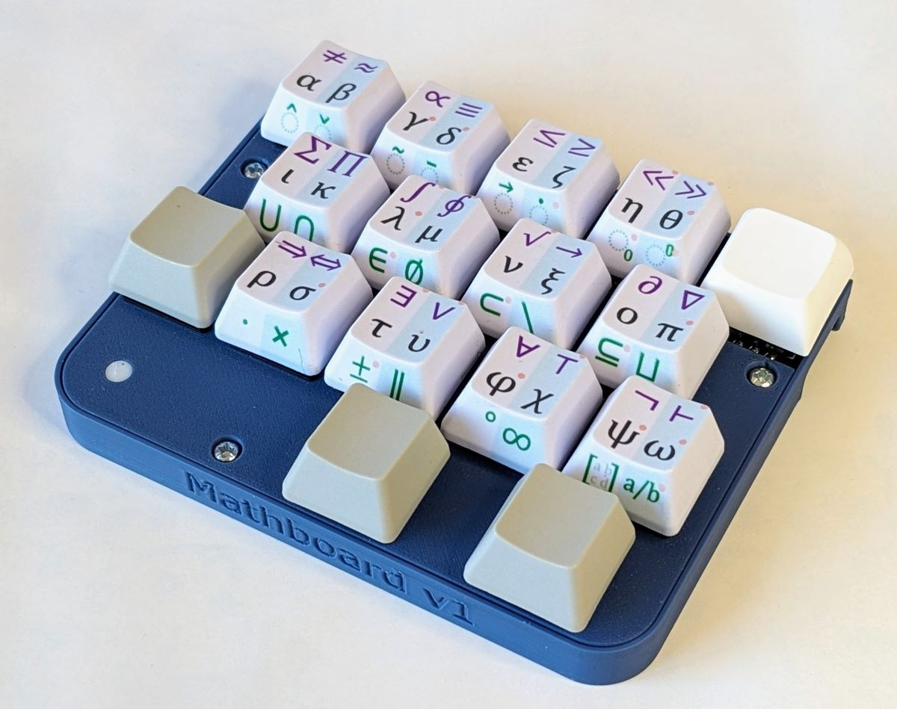

# Mathboard

[Documentation and instructions](https://mathboard.readthedocs.io/en/latest)

**This is the repository for Mathboard V1 Alpha.** It is not fully finished, but can be built if you tolerate 
lacking instructions and perhaps a few minor bugs or inconveniences. Join the 
[Mathboard Discord](https://discord.gg/dgD6cMCUhD) if you want to chat!

The Mathboard is a macropad to make it easier to write equations on a computer. It is intended for engineers, 
scientists, and anyone else who regularly need to write equations. This repository contains all the resources needed to 
make your own. 

With the Mathboard you can type 75 of the most common symbols used in algebra, calculus, set theory, and 
logic, as well as all greek letters (including uppercase). The following equations are a few examples of what you can 
type directly with the Mathboard:

 
E = mc² 
∛β ≫ ∯Ω(t)dt 
(A⊂B) ∧ (A⊂C) ⇔ A ⊂ (B ∪ C)
 

You can follow its development on Hackaday: https://hackaday.io/project/186205-math-keyboard

## Supported input methods
| Input mode                         | Supported |
|------------------------------------|-----------|
| Unicode plaintext                  | ✅        |
| LaTeX                              | ✅        |
| Microsoft Office equation editor   | ✅        |
| Apache Open Office equation editor | ❌        |

## Compatibility
The mathboard works on nearly all Unix systems, Apple macOS, and Windows. When using the Mathboard on Windows, the 
lightweight and open source application [WinCompose](https://github.com/samhocevar/wincompose) must be installed and running.

## Hardware
The mathboard has three main components:

1) A printed circuit board (PCB)
2) A 3D printed case
3) Custom keycaps

All the production files for the PCB are in `/hardware/pcb/Production files`, and can be uploaded directly to 
[JLCPCB](https://jlcpcb.com). You will have to purchase and manually solder the switches, the microcontroller, and the indicator LED.
A full purchase list can be found in `/hardware/Bill of Materials and Tools.md`.

The case of the Mathboard is very simple, and it should be possible for virtually all 3D printers to print it. 
The `.step` files are located in `/hardware/case`.

You should use OEM R2 keycaps, since the decals in `/hardware/keycaps/decals` are made for them. Their
shape also makes it easier to see the symbols printed on their front faces. You must find your own way of printing the 
keycaps. I have been using a UV printer, but you can also use [waterslide decals](https://www.reddit.com/r/MechanicalKeyboards/comments/nncx59/how_to_diy_custom_print_keycaps_using_waterslide/).

## Building and flashing the firmware
The newest firmware version can always be found in the [releases](https://github.com/nup002/Mathboard/releases). The releases also contain 
instructions on how to flash your Mathboard with the firmware.

If you wish to build the binaries yourself, for example after modifying the source files, you need to set up the 
build environment for QMK. This is not very difficult if you follow the 
[guide](https://docs.qmk.fm/#/newbs_getting_started). Once you've got the build environment set up, use the QMK CLI to
navigate to the `/firmware` and type `make`. 

## Licenses
The Mathboard firmware is licensed under the GNU General Public License v3. The Mathboard hardware is licensed under CERN-OHL-S v2. This includes the PCB design files, case design files, and the keycap decals. As an individual you are free to make your own Mathboard, or to modify it, as long as these licenses are respected.