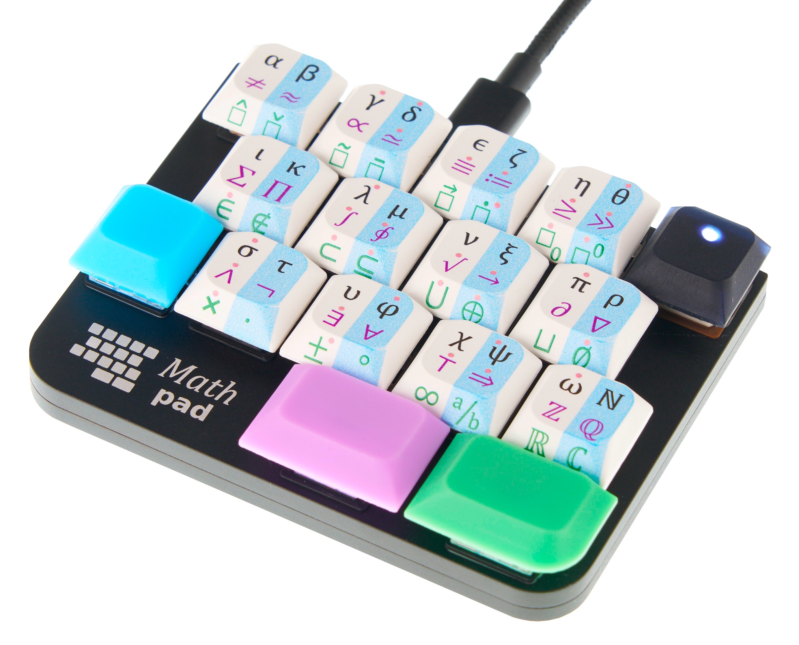
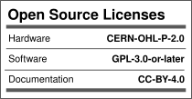
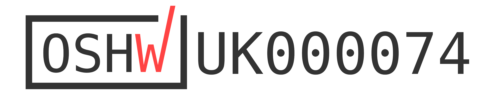

# Mathpad
### ➡️[Get yours](https://www.crowdsupply.com/summa-cogni/mathpad)⬅️ on Crowd Supply

  <table border="0" cellspacing="0" cellpadding="0" style="border-collapse: collapse;">
    <tr>
      <td align="center" width="33%" style="border: none;">
         
        
Learn more about Mathpad with the 
        <a href="https://summa-cogni.github.io/Mathpad/#/">Official Documentation</a>.

      </td>
      <td align="center" width="33%" style="border: none;">
         
        
Chat with other users and ask your questions in the
        <a href="https://discord.gg/dgD6cMCUhD">Mathpad Discord</a>.

      </td>
      <td align="center" width="33%" style="border: none;">
         
        
Get the latest updates about Mathpad on
        <a href="https://x.com/SummaCogni">Twitter/X</a>.

      </td>
    </tr>
  </table>

## What is it?
Mathpad is a keypad that makes it easy to type equations. It is intended for engineers, 
scientists, students, and professionals in STEM fields who regularly need to write equations or who use 
mathematical symbols in their day-to-day work. 

With the Mathpad you can type 112 symbols from algebra, calculus, set theory, and 
logic, and the full greek alphabet. Mathpad plugs into your computer with a USB-C cable and 
works seamlessly alongside your regular keyboard.

The following equations are a few examples of what you can 
type directly with the Mathpad:

 
E = mc² 
∛β ≫ ∯Ω(t)dt 
(A⊂B) ∧ (A⊂C) ⇔ A ⊂ (B ∪ C)
 

## Where to buy
Mathpad will very soon be available on [Crowd Supply](https://www.crowdsupply.com/summa-cogni/mathpad). Click the link and subscribe to be notified when it's available!

## Compatibility
Mathpad works on Windows, Apple macOS, and virtually all Unix systems.

Several output modes are supported. Plaintext outputs standard Unicode symbols and can be used practically anywhere. LaTeX is 
of course also supported, as well as the equation editor of Microsoft Office.
| Output mode                      | Supported |
|----------------------------------|-----------|
| Plaintext                        | ✅        |
| LaTeX                            | ✅        |
| Microsoft Office equation editor | ✅        |
| LibreOffice equation editor      | ❌ (in development)|

Mathpad works on all computers with Latin keyboard layouts. This includes nearly all western layouts, including 
US ANSI, UK, French AZERTY, DVORAK, and many more. For a full list of all supported keyboard layouts, 
see [this list](https://docs.qmk.fm/reference_keymap_extras#header-files).

## Firmware releases
Official releases will be located in [releases](https://github.com/Summa-Cogni/Mathpad/releases). The firmware is under development 
and therefore no official release exists yet.

If you wish to build the firmware binaries yourself, follow [this guide](https://summa-cogni.github.io/Mathpad/#/firmware) from the official documentation.

## Licenses

Everyone is permitted to replicate the Mathpad based on the design files found in this repository. Everyone is
 permitted to modify, share, and distribute the files, as long as the terms set out in the licenses are respected.

The Summa Cogni logo and the Mathpad logo are the properties of Summacogni OÜ, and may not be replicated.

The OSHWA certification ID `UK000074` is issued to Summacogni OÜ, and may not be replicated.

## Certifications
Mathpad is certified by the Open Source Hardware Association.

