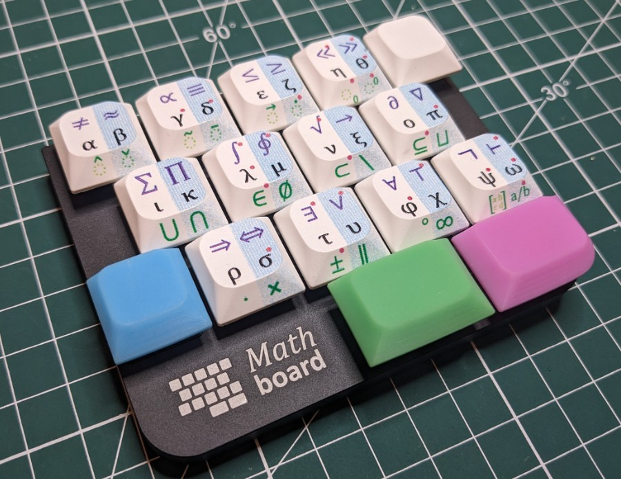

# Mathboard

[Documentation and instructions for beta version](https://mathboard.readthedocs.io/en/latest)

**This is the official Mathboard repository**. The mathboard is still a work in progress. The design files 
may therefore change without notice. The beta version is released and you can build your own if you wish. See the link above for instructions.
Join the [Mathboard Discord](https://discord.gg/dgD6cMCUhD) if you want to chat!

The Mathboard is a macropad that makes it easier to write equations on a computer. It is intended for engineers, 
scientists, and anyone else who regularly need to write equations. The Mathboard is fully open source and this 
repository collects the design files, schematics, and documentation.

With the Mathboard you can type 75 of the most common symbols used in algebra, calculus, set theory, and 
logic, as well as all greek letters (including uppercase). The following equations are a few examples of what you can 
type directly with the Mathboard:

 
E = mc² 
∛β ≫ ∯Ω(t)dt 
(A⊂B) ∧ (A⊂C) ⇔ A ⊂ (B ∪ C)
 

You can follow its development on Hackaday: https://hackaday.io/project/186205-math-keyboard

## Supported input methods
| Input mode                         | Supported |
|------------------------------------|-----------|
| Unicode plaintext                  | ✅        |
| LaTeX                              | ✅        |
| Microsoft Office equation editor   | ✅        |
| Apache Open Office equation editor | ❌        |

## Compatibility
The Mathboard works on nearly all Unix systems, Apple macOS, and Windows. When using the Mathboard on Windows, the 
lightweight and open source application [WinCompose](https://github.com/samhocevar/wincompose) must be installed and running.
When using it on Apple macOS, you must enable Unicode Hex Input as a keyboard input source.

## Hardware
The mathboard has three main components:

1) A printed circuit board (PCB)
2) An aluminum enclosure
3) Custom keycaps

All the production files for the PCB are in `/hardware/pcb/Production files`, and can be uploaded directly to 
[JLCPCB](https://jlcpcb.com). You will have to purchase and manually solder the Gateron switches.
A full purchase list can be found in [Components and Tools](https://mathboard.readthedocs.io/en/latest/Components%20and%20tools.html)

The enclosure can be CNCed or 3D printed. The `.step` files are located in `/hardware/case`.

## Building and flashing the firmware
The newest firmware version can always be found in the [releases](https://github.com/nup002/Mathboard/releases). The releases also contain 
instructions on how to flash your Mathboard with the firmware.

If you wish to build the binaries yourself, for example after modifying the source files, you need to set up the 
build environment for QMK. This is not very difficult if you follow the 
[guide](https://docs.qmk.fm/#/newbs_getting_started). Once you've got the build environment set up, use the QMK CLI to
navigate to the `/firmware` and type `make`. 

## Licenses
The Mathboard firmware is licensed under the GNU General Public License v3. The Mathboard hardware is licensed under CERN-OHL-S v2. This includes the PCB design files, case design files, and the keycap decals. As an individual you are free to make your own Mathboard, or to modify it, as long as these licenses are respected.
