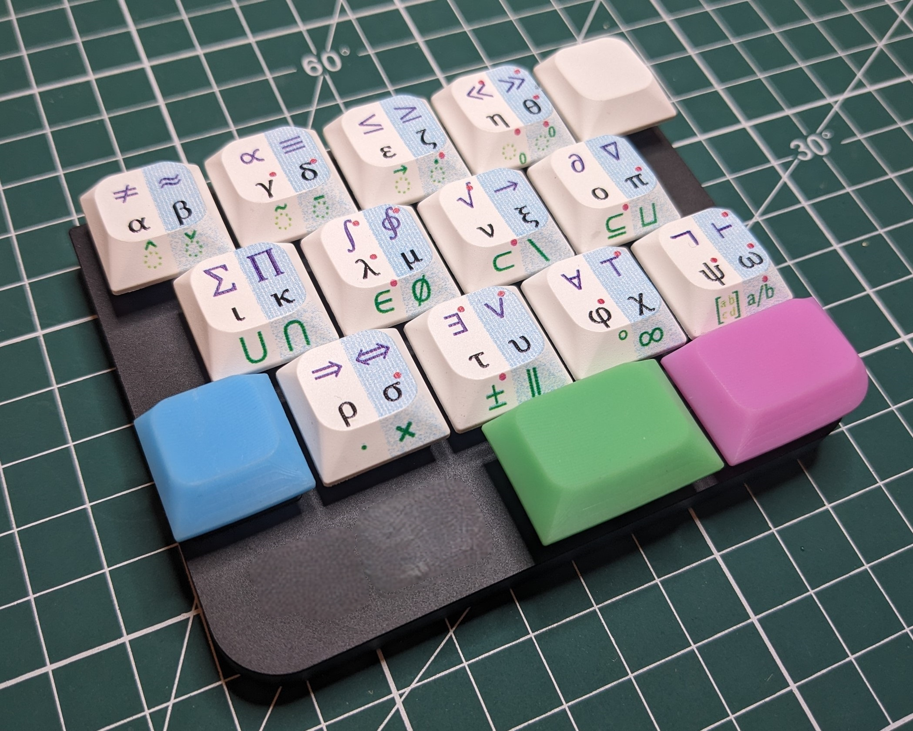

# Mathpad

[Documentation](https://mathpad.readthedocs.io/en/latest)

**Disclaimer:** Mathpad is still a work in progress and the design files contained in this repository may therefore change without notice.

Join the [Mathpad Discord](https://discord.gg/dgD6cMCUhD) if you want to chat!

Mathpad is a keypad that make writing equations on a computer effortless. It is intended for engineers, 
scientists, and anyone else who regularly need to write equations. The Mathpad is fully open source and this 
repository collects the source code, design files, schematics, documentation.

With a Mathpad you can type 75 of the most common symbols used in algebra, calculus, set theory, and 
logic, as well as all greek letters (including uppercase). The following equations are a few examples of what you can 
type directly with the Mathpad:

 
E = mc² 
∛β ≫ ∯Ω(t)dt 
(A⊂B) ∧ (A⊂C) ⇔ A ⊂ (B ∪ C)
 

You can follow its development on [Hackaday](https://hackaday.io/project/186205-math-keyboard)

## Supported input methods
| Input mode                         | Supported |
|------------------------------------|-----------|
| Unicode plaintext                  | ✅        |
| LaTeX                              | ✅        |
| Microsoft Office equation editor   | ✅        |
| Apache Open Office equation editor | ❌        |

## Compatibility
Mathpad works on Windows, virtually all Unix systems, and Apple macOS. When using a Mathpad on Windows, the 
lightweight and open source application [WinCompose](https://github.com/samhocevar/wincompose) must be installed and running.
When using it on Apple macOS, you must enable Unicode Hex Input as a keyboard input source.

## Hardware
The Mathpad has three main components:

1) A custom printed circuit board
2) An aluminum enclosure
3) Custom keycaps

All the production files for the PCB are in `/hardware/pcb/Production files`, and can be uploaded directly to 
[JLCPCB](https://jlcpcb.com). 

The enclosure must be CNCed. The `.step` files are located in `/hardware/case`.

The custom keycaps will be purchaseable in the future.

## Building and flashing the firmware
Official releases will be located in [releases](https://github.com/nup002/Mathpad/releases). The firmware is under development 
and therefore no official release exists yet.

If you wish to build the firmwre binaries yourself, you need to set up the build environment for QMK. This is not very difficult 
if you follow the [guide](https://docs.qmk.fm/#/newbs_getting_started). Once you've got the build environment set up, use the QMK 
CLI to navigate to `/firmware` and type `make`. 

## Licenses
The Mathpad firmware is licensed under the GNU General Public License v3. The Mathpad hardware is licensed under CERN-OHL-S v2. This includes the PCB design files, case design files, and the keycap decals. As an individual you are free to make your own Mathpad, or to modify it, as long as these licenses are respected.

The Summa Cogni logo and Mathpad logo are the properties of Summcogni OÜ and may not be replicated.